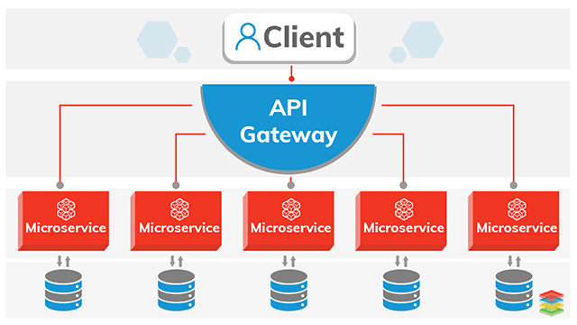

= About this Repository

This Repository contains a collection of tools  and
services that you may need when building a microservices based system with (CQRS) and (Event-Sourcing)

= Quick links

. <<Frameworks,Frameworks>>
. <<Containers,Containers>>
. <<Orchestration,Containers Orchestration>>
. <<Discovery,Service Discovery>>
. <<Gateways,Api Gateways>>
. <<Sourcing,Event Sourcing>>
. <<Logging,Logging>>
. <<Monitoring,Monitoring>>
. <<Documentation,Documentation>>
. <<Testing,Testing>>

= What is a microservices

Microservices are a software development technique
—a variant of the service-oriented architecture (SOA) structural style—
that arranges an application as a collection of loosely coupled services.
In a microservices architecture,
services are fine-grained and the protocols are lightweight.
Defination from wikipedia : https://en.wikipedia.org/wiki/Microservices

= Useful Readings

https://microservices.io/

[[Frameworks]]
= Tools (What to use when building a microservice)

This list is not a must it's for reference and to be can be updated anyone using a different tool
|===
|Tool  | Language | Website
|Spring boot
|Java
|https://spring.io/projects/spring-framework
|Microsoft.Net Core
|c#
|https://docs.microsoft.com/en-us/dotnet/core/
|Grails Groovy
|Java
|https://grails.org/
|Eclipse Vertx
|Java
|https://vertx.io/
|Helidon
|Java - Kotlin
|https://helidon.io/
|Fresh Squeezed Limonade
|PHP
|https://github.com/yesinteractive/fsl
|Lumen
|PHP
|https://lumen.laravel.com/
|MolecularJs
|Javascript
|https://moleculer.services/
|NodeJs
|Javascript
|https://nodejs.org/en/
|===

= Containerization

A container is a standard unit of software that packages up code and all its dependencies so the application runs quickly and reliably from one computing environment to another.

= Useful Readings

https://www.docker.com/resources/what-container

[[Containers]]
= Tools (What to use as a Containerization solution)

This list is not a must it's for reference and to be can be updated anyone using a different tool

|===
|Tool  | Website
|Docker
|https://hub.docker.com/
|CoreOS rkt
|https://coreos.com/rkt/docs/latest/
|Linuxcontainers LXC
|https://linuxcontainers.org/
|OpenVZ
|https://openvz.org/
|Containerd
|https://containerd.io/
|===

= Containers Orchestration

It groups containers that make up an application into logical units for easy management and discovery.
= Useful Readings

https://kubernetes.io/

[[Orchestration]]

= Tools (What to use as a Containers Orchestration solutions)

This list is not a must it's for reference and to be can be updated anyone using a different tool

|===
|Tool  | Website
|Kubernetes
|https://kubernetes.io/
|Docker Swarm
|https://docs.docker.com/engine/swarm/
|OpenShift
|https://www.openshift.com/
|Diego
|https://docs.cloudfoundry.org/concepts/diego/diego-architecture.html#diagram
|CoreOs Fleet
|https://coreos.com/fleet/docs/latest/
|Mesos Marathon
|https://mesosphere.github.io/marathon/
|Amazon ECS
|https://aws.amazon.com/ecs/
|Amazon ECR
|https://aws.amazon.com/ecr/
|Azure K8s Service
|https://azure.microsoft.com/en-us/services/kubernetes-service/
|===

= Service Discovery

Let’s imagine that you are writing some code that invokes a service that has a REST API or Thrift API. In order to make a request, your code needs to know the network location (IP address and port) of a service instance. In a traditional application running on physical hardware, the network locations of service instances are relatively static. For example, your code can read the network locations from a configuration file that is occasionally updated.

= Useful Readings

https://www.nginx.com/blog/service-discovery-in-a-microservices-architecture/

[[Discovery]]

= Tools (What to use as a Service Discovery solution)

This list is not a must it's for reference and to be can be updated anyone using a different tool

|===
|Tool  | Website
|Consul
|https://www.consul.io/
|Apache ZooKeeper
|https://zookeeper.apache.org/
|Etcd
|https://github.com/etcd-io/etcd
|Eeureka
|https://github.com/Netflix/eureka
|Smartstack
|https://github.com/airbnb/smartstack-cookbook
|SkyDNS
|https://github.com/skynetservices/skydns
|Bakerstreet
|https://github.com/datawire/bakerstreet
|===

= Api Gateways

An API gateway takes all API calls from clients, then routes them to the appropriate microservice with request routing, composition, and protocol translation. Typically it handles a request by invoking multiple microservices and aggregating the results, to determine the best path. It can translate between web protocols and web‑unfriendly protocols that are used internally.
= Useful Readings

https://www.nginx.com/learn/api-gateway/

[[Gateways]]

= Tools (What to use as a Api gateway solution)

This list is not a must it's for reference and to be can be updated anyone using a different tool

|===
|Tool  | Website
|Kong
|https://konghq.com/kong/
|Ambassador
|https://www.getambassador.io/
|Ocelot
|https://github.com/ThreeMammals/Ocelot
|Tyk
|https://tyk.io/
|Amazon AWS Gateway
|https://aws.amazon.com/api-gateway/
|Azure Application Gateway
|https://docs.microsoft.com/en-us/azure/application-gateway/overview
|Spring Cloud
|https://spring.io/projects/spring-cloud
|KrakenD
|https://www.krakend.io/
|===

= Event Bus

Event driven architecture pattern is a distributed asynchronous architecture pattern to create highly scalable reactive applications. The pattern suits for on every level application stack from small to complex ones. The main idea is delivering and processing events asynchronously.

= Useful Readings

https://hackernoon.com/event-bus-implementation-s-d2854a9fafd5

[[Sourcing]]

= Tools (What to use as a Event Bus solution)

This list is not a must it's for reference and to be can be updated anyone using a different tool

|===
|Tool  | Website
|Apache kafka
|https://kafka.apache.org/
|Rabbit MQ
|https://www.rabbitmq.com/
|Azure Service bus
|https://azure.microsoft.com/en-us/services/service-bus/?ef_id=Cj0KCQiA1-3yBRCmARIsAN7B4H0iLfdqXdXdY-H3vw1dU__bn6wscnCict2F4_RdhJXLFhbpReq-tDYaAoj1EALw_wcB%3AG%3As&OCID=AID2000076_SEM_e9PC46VT&MarinID=e9PC46VT_324582039256_azure%20service%20bus_e_c__71931028028_kwd-318783172040&lnkd=Google_Azure_Brand&dclid=CNeUzvOx-ucCFQzkuwgdYF4Mdg
|Amazon SQS
|https://aws.amazon.com/sqs/
|Google Cloud Pub/Sub
|https://cloud.google.com/pubsub/docs/overview
|===

= Logging

Each service instance generates writes information about what it is doing to a log file in a standardized format. The log file contains errors, warnings, information and debug messages.

= Useful Readings

https://microservices.io/patterns/observability/application-logging.html

[[Logging]]

= Tools (What to use as a Logging solution)

This list is not a must it's for reference and to be can be updated anyone using a different tool

|===
|Tool  | Website
|Fluentd
|https://www.fluentd.org/
|Graylog
|https://www.graylog.org/
|Logstash
|https://www.elastic.co/logstash
|Bunyan
|https://github.com/trentm/node-bunyan
|Suro
|https://github.com/Netflix/suro
|CloudWatch
|https://aws.amazon.com/cloudwatch
|Kibana
|https://www.elastic.co/kibana
|===

= Monitoring

[[Monitoring]]

= Tools (What to use as a Monitoring solution)

This list is not a must it's for reference and to be can be updated anyone using a different tool

|===
|Tool  | Website
|Grafana
|https://grafana.com/
|Prometheus
|https://prometheus.io/
|cAdvisor
|https://github.com/google/cadvisor
|Riemann
|http://riemann.io/
|Spigo
|https://www.spigotmc.org/resources/lagmonitor.21348/?__cf_chl_jschl_tk__=134eae81f7fcca7748cef25cf0b537500782b487-1583104534-0-AayA-zzcVh0KIjL08ER8ojxteMEUsHCOn9EwVTqMFcVtqWU3eUv8KUiiltEbyh2rzkIoEfVOd9C_4ha-5aKFEbfEchSbNScDZQRfRN5tY6TpQhPWV-wAvuo3b9RrJnfZFkz3dFzfMA1MWQprj2JeS0O02cnwi0cTE8YTGVogFWtmo4RRfgyDuW3CB3UVJMhM5guQJbCF5ulLl5EkGhcpmPynsyQIytizfWRnRNuLDnEgYUhwPJIXY_5Y2AV2HRlhookupXDMctySU_h83qfmiNWR6rfouzJsbiEXnjTjk7kpLbSC2i7432QRZuRv-Avgyw
|Sensu
|https://sensu.io/
|Sysdig
|https://sysdig.com/
|NewRelic
|https://newrelic.com/
|zabbix
|https://www.zabbix.com/
|ntop
|https://www.ntop.org/
|===

= Documentation

Api documentation

[[Documentation]]

= Tools (What to use as a Documentation solution)

This list is not a must it's for reference and to be can be updated anyone using a different tool

|===
|Tool  | Website
|Swagger
|https://swagger.io/
|Apiary
|https://apiary.io/how-apiary-works
|Slate
|https://github.com/slatedocs/slate
|Gelato
|https://developers.gelato.com/documentation/v2/
|Aglio
|https://github.com/danielgtaylor/aglio
|LucyBot’s DocGen
|https://lucybot.com/docgen
|===

= Testing

Api documentation

[[Testing]]

= Tools (What to use as a Documentation solution)

This list is not a must it's for reference and to be can be updated anyone using a different tool

|===
|Tool  | Website
|Postman
|https://www.postman.com/
|Hoverfly
|https://hoverfly.io/
|Pact
|https://docs.pact.io/
|Gatling
|https://gatling.io/
|RestAssured
|https://github.com/rest-assured/rest-assured
|Citrus
|https://citrusframework.org/
|===
